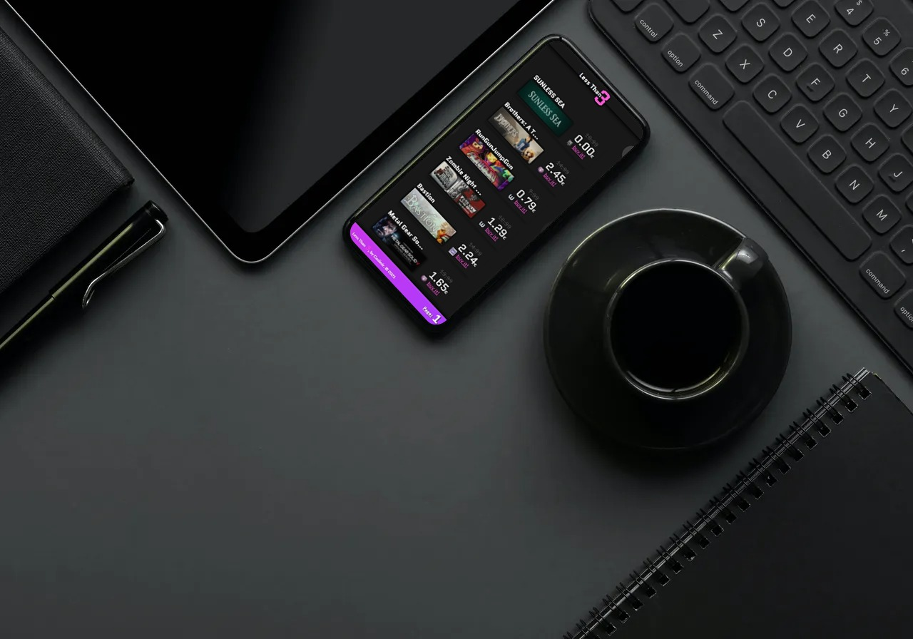
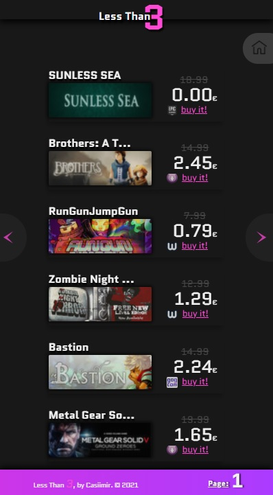
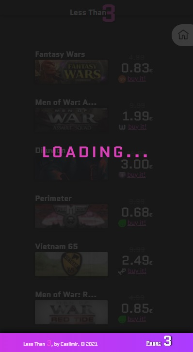

<h1>Less 3 Than - The Heming(way) approach to buy game keys</h1>
<h2>How to find the best and cheapest game keys from internet</h2>

  

<h2>Less3️⃣Than - for whom code types ⌨️, and gamers! 🎮</h2>

  Less 3 Than is a very usefull web app that's kind of all gamers wants! It makes it possibile to find the lowest price available for any video game (actually only PC/Mac), under 3$! By comparing more than 25 store (actually).
  The web app takes the gamer by the hand and guides him towards the lists of the cheapest and top rated games, his store and the link where buy it, with a common interface, minimal and clear design.
  The most incredibile thing to ever happen in other website is the presence of free games too!! 

  
<h2>Improvements to be made ⏳</h2>
<ol>
  <li>Sort by price</li>
  <li>Select range of price, from - to</li>
  <li>Dedicated sections for every game</li>
  <li>Specific stores section</li>
  <li>More interactivity for the user</li>
  <li>Add more stores to compare</li>
  <li>and much more...</li>
</ol>

<h3>More info about?</h3>
<a href="#">Follow this link to Hashnode</a>

<h2>MIT License</h2>

<h3>Do you like my app? Would you support me? 🙏</h3>
<h4>Buy me a coffee ☕</h4>

